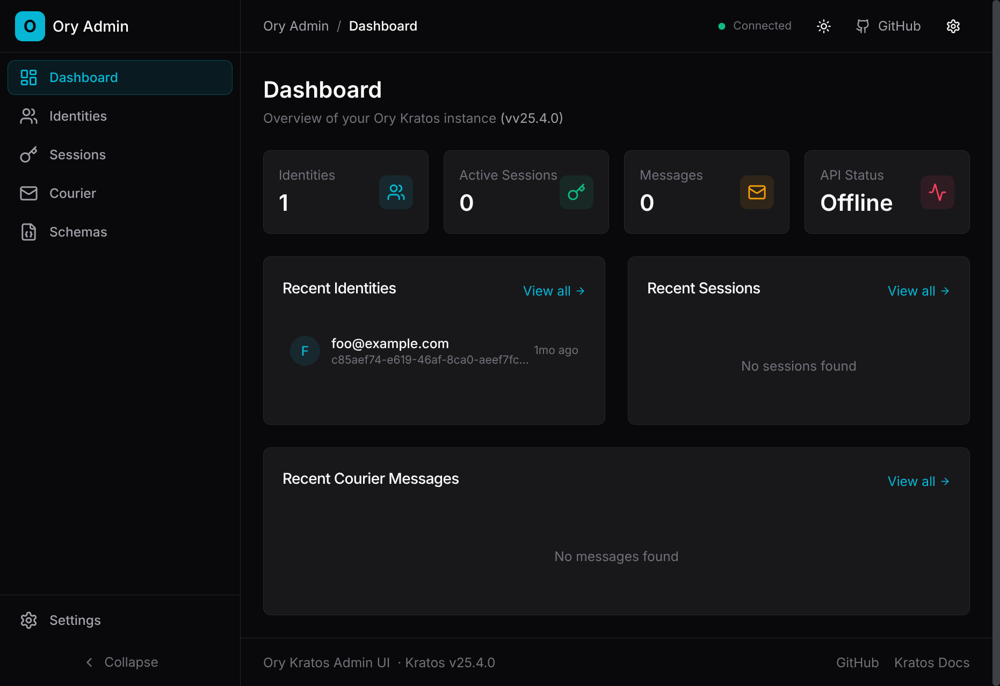

# Kratos Admin

[](https://github.com/licenseware/ory-admin-ui)
[](https://hub.docker.com/r/licenseware/ory-admin-ui)
[](https://github.com/licenseware/ory-admin-ui/releases)
[](https://hub.docker.com/r/licenseware/ory-admin-ui)
[](https://github.com/licenseware/ory-admin-ui/commits/main/)
[](https://opensource.org/licenses/Apache-2.0)
[](http://makeapullrequest.com)
[](https://www.ory.sh/)

Admin UI for [Ory Kratos](https://www.ory.sh/docs/kratos). Manage identities, sessions, and schemas.



## Quick Start

```bash
docker run -p 8080:8080 licenseware/ory-admin-ui
```

Open http://localhost:8080, configure your Kratos endpoint in the Settings tab.

### With Custom Endpoints

```bash
cat > config.json <<EOF
{
  "kratosAdminBaseURL": "https://kratos-admin.example.com",
  "kratosPublicBaseURL": "https://kratos-public.example.com"
}
EOF
docker run -p 8080:8080 -v ./config.json:/public/config.json:ro licenseware/ory-admin-ui
```

**NOTE**: You must ensure the CORS is setup corrrectly, i.e., by putting the
Kratos Admin URL behind a load-balancer/reverse-proxy.

## Features

- Identity CRUD with pagination
- Session management and revocation
- Courier message viewer
- Identity schema browser
- Dark/light theme with system preference detection
- Runtime configuration (no rebuild needed)
- Responsive design

## Configuration

The API endpoints can be configured in three ways (in order of priority):

**Two endpoints are available:**

| Endpoint              | Default Port | Purpose                                 |
| --------------------- | ------------ | --------------------------------------- |
| `kratosAdminBaseURL`  | 4434         | Admin API - identity CRUD, session mgmt |
| `kratosPublicBaseURL` | 4433         | Public API - identity schemas           |

### 1. User Override (Settings UI)

Users can set a custom endpoint via the Settings page. Saved to localStorage, takes highest priority.

### 2. Runtime Configuration (Recommended)

Mount a `config.json` file at runtime:

```json
{
  "kratosAdminBaseURL": "https://kratos-admin.example.com",
  "kratosPublicBaseURL": "https://kratos-public.example.com"
}
```

**Docker:**

```bash
docker run -p 8080:8080 \
  -v ./config.json:/public/config.json:ro \
  licenseware/ory-admin-ui
```

**Kubernetes:**

```yaml
spec:
  containers:
    - name: kratos-admin
      image: licenseware/ory-admin-ui:latest
      volumeMounts:
        - name: config
          mountPath: /public/config.json
          subPath: config.json
          readOnly: true
  volumes:
    - name: config
      configMap:
        name: kratos-admin-config
        optional: false
        defaultMode: 0444
```

### 3. Build-time Environment Variable

Set during build (baked into the bundle):

```bash
VITE_DEFAULT_API_ENDPOINT=http://localhost:4434
VITE_DEFAULT_PUBLIC_API_ENDPOINT=http://localhost:4433
```

**Priority:** User Override > Runtime Config > Build-time Env > Default

- Admin API default: `http://localhost:4434`
- Public API default: `http://localhost:4433`

## Development

```bash
bun install && bun start
```

## Vision

Building a unified admin UI for the [Ory](https://www.ory.sh/) ecosystem. Currently supports Kratos.

Hydra, Keto, and Oathkeeper support planned.

## Contributing

PRs welcome. Fork, branch, PR.

## License

[Apache-2.0](LICENSE)
